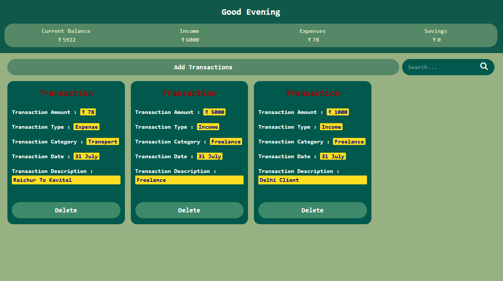
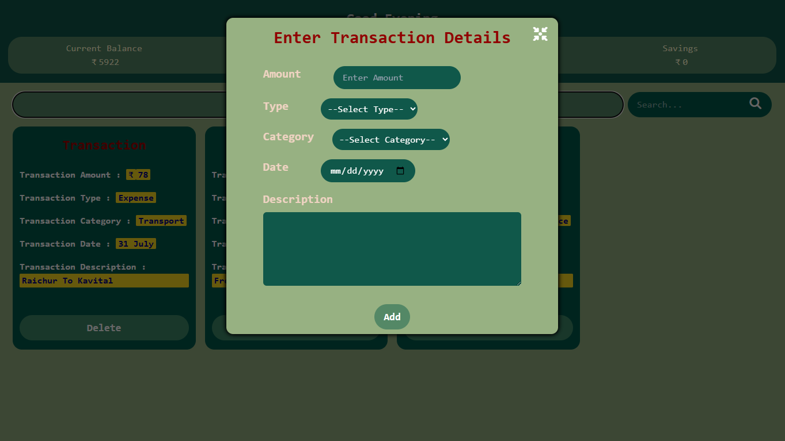
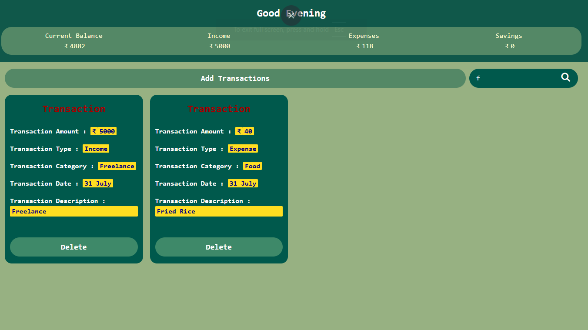

# 💰 Expense Tracker

A modern, responsive, and user-friendly **Expense Tracker** built with **HTML5**, **Tailwind CSS**, and **Vanilla JavaScript**.

This application helps users manage their income and expenses, track their current balance, search transactions instantly, and store data locally without requiring a backend.

---

## 🚀 Live Demo

🔗 https://your-vercel-link.vercel.app

---

## 📸 Preview

### Home



### Add Transaction



### Search



### Mobile View


---

## ✨ Features

- 💵 Add Income Transactions
- 💸 Add Expense Transactions
- 🗑️ Delete Transactions
- 🔍 Live Search
- 💾 Local Storage Support
- 📊 Real-Time Balance Calculation
- 🌞 Greeting Based on Local Time
- 🔔 Beautiful Toast Notifications
- 📱 Responsive Design
- ⚡ Modular JavaScript Architecture

---

## 🛠️ Tech Stack

### Frontend

- HTML5
- Tailwind CSS v4
- Vanilla JavaScript (ES6 Modules)

### Storage

- Local Storage API

### Deployment

- Vercel

### Version Control

- Git
- GitHub

---

## 📂 Folder Structure

```text
Expense-Tracker/
│
├── assets/
├── css/
├── js/
├── preview/
├── index.html
├── package.json
├── package-lock.json
└── README.md
```

---

## 🎯 What I Learned

During this project, I practiced and improved my skills in:

- ES6 Modules
- DOM Manipulation
- Event Handling
- Dynamic UI Rendering
- CRUD Operations
- Array Methods (`map`, `filter`, `reduce`)
- Local Storage
- Form Validation
- Responsive Web Design
- Git & GitHub Workflow

---

## 🔮 Future Improvements

- ✏️ Edit Transactions
- 📅 Filter by Date
- 📈 Charts & Analytics
- 🌙 Dark Mode
- 📤 Export to CSV
- ☁️ Backend Integration
- 🔐 User Authentication

---

## 🤝 Contributing

Contributions are welcome!

Feel free to fork this repository and submit a pull request.

---

## 📄 License

This project is licensed under the MIT License.

---

## 👨‍💻 Author

**Moyin Pasha**

GitHub: https://github.com/moyin-pasha-69

LinkedIn: https://www.linkedin.com/in/moyin-pasha-7a68aa330/

---

⭐ If you found this project helpful, don't forget to star the repository.
